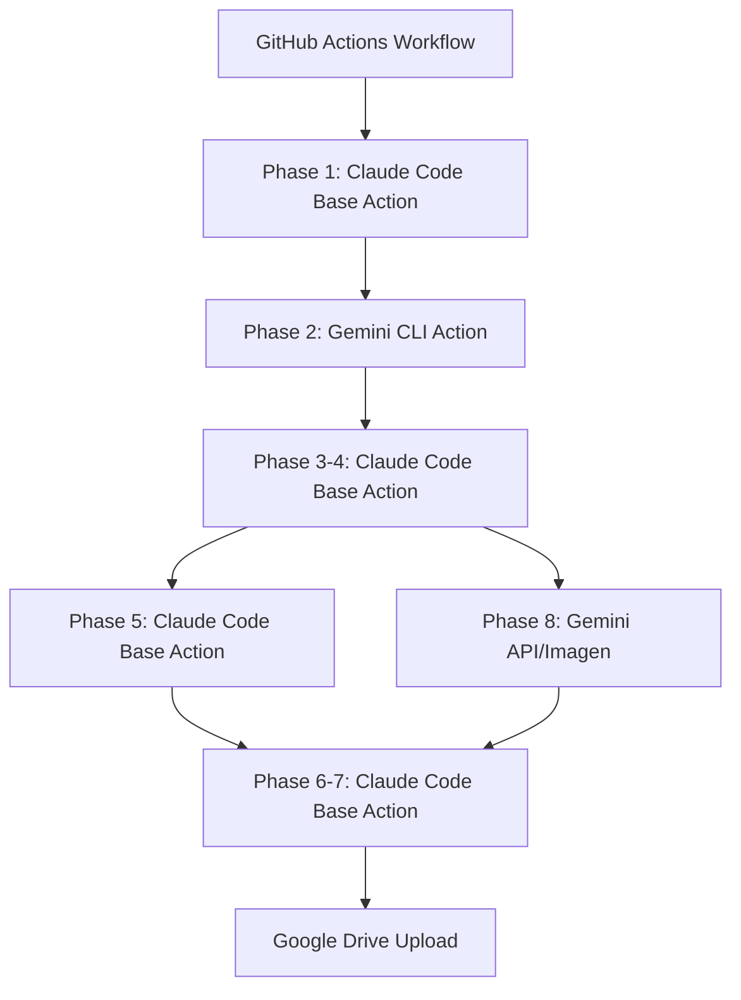

# 🚨 現在の実装の重大な問題点と修正案

## 1. Claude Code SDKの誤った実装

### ❌ 現在の問題点
- `install_claude_code.sh` でCLIをインストールしようとしている
- `phase1_request_analysis_sdk.py` でsubprocessでCLIを呼び出している
- **これは動作しません！** (`claude -p --resume`は非対話モードで動作しない)

### ✅ 正しい実装
```yaml
- uses: anthropics/claude-code-base-action@beta
  with:
    prompt_file: prompts/phase1_analysis.md  # または prompt: "直接プロンプト"
    anthropic_api_key: ${{ secrets.ANTHROPIC_API_KEY }}
    allowed_tools: "View,Edit,Write"
    claude_env: |
      PHASE: phase1
      OUTPUT_DIR: ${{ steps.init.outputs.article_id }}
```

## 2. Gemini CLIの誤ったパッケージ名

### ❌ 現在の問題点
```bash
npm install -g @google/generative-ai-cli  # 存在しないパッケージ
```

### ✅ 正しい実装
```bash
npm install -g @google/gemini-cli  # 正しいパッケージ名
```

## 3. 並列処理の未実装

### ❌ 現在の問題点
- すべてのフェーズが直列実行
- 画像生成とファクトチェックなど、並列化可能な処理も直列

### ✅ 正しい実装（GitHub Actions並列ジョブ）
```yaml
jobs:
  phase1-analysis:
    runs-on: ubuntu-latest
    outputs:
      analysis: ${{ steps.analysis.outputs.result }}
    steps:
      - uses: anthropics/claude-code-base-action@beta
        id: analysis
        with:
          prompt_file: prompts/phase1.md
          
  phase2-research:
    needs: phase1-analysis
    runs-on: ubuntu-latest
    steps:
      - uses: google-gemini/gemini-cli-action@main
        with:
          api_key: ${{ secrets.GEMINI_API_KEY }}
          prompt: "Web search with context from: ${{ needs.phase1-analysis.outputs.analysis }}"
          
  phase3-4-writing:
    needs: phase2-research
    runs-on: ubuntu-latest
    # ... 記事執筆
    
  # 並列実行
  phase5-factcheck:
    needs: phase3-4-writing
    runs-on: ubuntu-latest
    # ... ファクトチェック
    
  phase8-images:
    needs: phase3-4-writing  # phase5と並列実行
    runs-on: ubuntu-latest
    # ... 画像生成
```

## 4. Python スクリプトの過度な使用

### ❌ 現在の問題点
- 各フェーズをPythonスクリプトで実装
- Claude/Gemini APIを直接呼び出し

### ✅ 正しい実装
- Claude Code Base ActionとGemini CLI Actionを直接使用
- Pythonスクリプトは最小限に（データ処理のみ）

## 5. 修正後のアーキテクチャ



## 6. 即座に必要な修正

1. **ワークフローファイルの全面書き換え**
   - Claude Code Base Actionの使用
   - Gemini CLI Actionの使用
   - 並列ジョブの実装

2. **不要なファイルの削除**
   - `install_claude_code.sh`
   - `claude_code_sdk.py`
   - 各フェーズのPythonスクリプト（一部）

3. **プロンプトファイルの作成**
   - 各フェーズ用のMarkdownプロンプト
   - YAMLから参照

## 7. 推奨される新しい実装フロー

```yaml
name: Article Generation Pipeline v2
on:
  workflow_dispatch:
    inputs:
      topic:
        required: true
        
jobs:
  # ジョブ1: リクエスト解析（Claude）
  analyze-request:
    runs-on: ubuntu-latest
    outputs:
      keywords: ${{ steps.analyze.outputs.keywords }}
      queries: ${{ steps.analyze.outputs.queries }}
    steps:
      - uses: anthropics/claude-code-base-action@beta
        id: analyze
        with:
          prompt: |
            Analyze article request for: ${{ inputs.topic }}
            Return JSON with main_keyword, research_queries, etc.
          
  # ジョブ2: Web検索（Gemini）
  research:
    needs: analyze-request
    runs-on: ubuntu-latest
    steps:
      - uses: google-gemini/gemini-cli-action@main
        with:
          queries: ${{ needs.analyze-request.outputs.queries }}
          tools: web_search
          
  # ジョブ3-7: 記事生成（Claude）
  generate-article:
    needs: research
    # ... Claude Code Base Actionで実装
    
  # 並列ジョブ: 画像生成とファクトチェック
  generate-images:
    needs: generate-article
    # ... 並列実行
    
  factcheck:
    needs: generate-article
    # ... 並列実行
```

---

**結論**: 現在の実装は根本的に間違っています。GitHub Actions専用のActionを使わず、CLIを直接呼び出そうとしているため、動作しません。早急な修正が必要です。